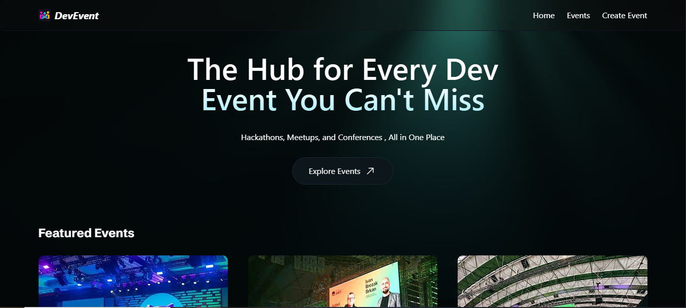
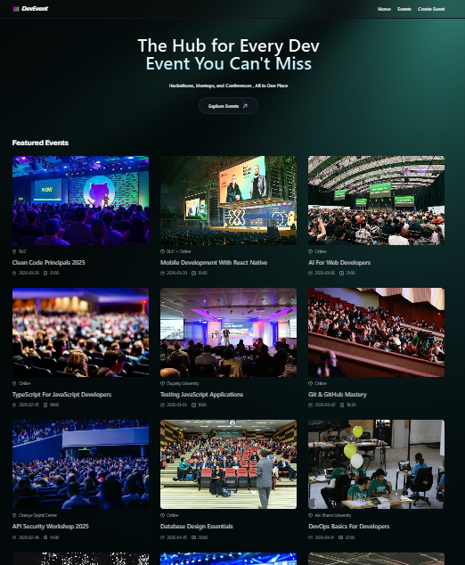
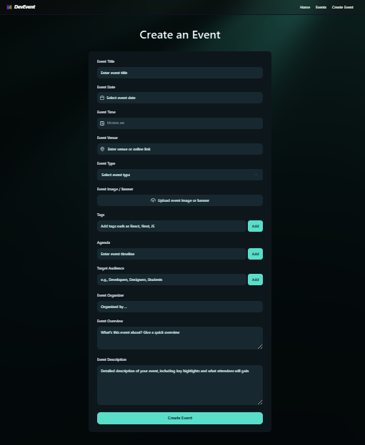
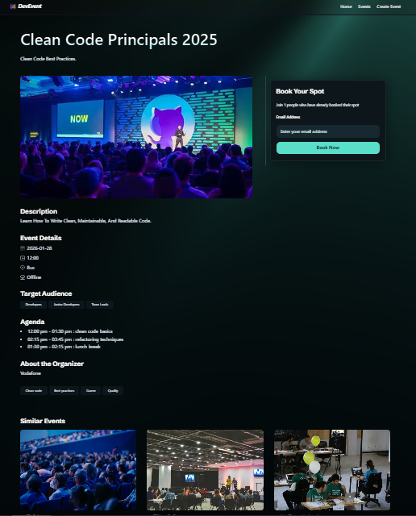
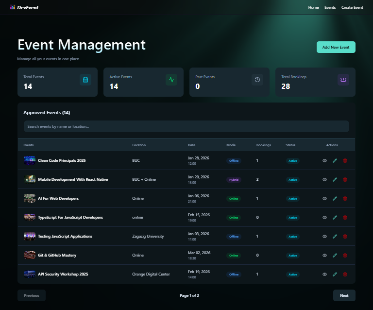
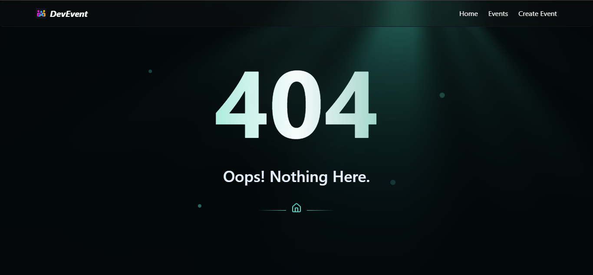

# 🎯 DevEvent - Developer Events Platform

<div align="center">



**Full-stack event management platform for the developer community**

[](https://deveventsplatform.vercel.app)
[](https://nextjs.org/)
[](https://www.typescriptlang.org/)
[](https://www.mongodb.com/)

</div>

---

## 🚀 About

DevEvent is a centralized platform for discovering and managing tech events. Developers can browse hackathons, meetups, and conferences while organizers can create and manage events with built-in moderation.

**Tech Stack:** Next.js 16 • TypeScript • MongoDB • Tailwind CSS • Cloudinary

---

## ✨ Features

### 👥 User Features
- **Browse & Search** - Discover tech events by location, date, and type
- **One-Click Booking** - Register with just an email (no account needed)
- **Create Events** - Submit events with image upload and rich details
- **Smart Filtering** - Find events by tags, mode (online/offline), and dates

### 🔐 Admin Features
- **Dashboard** - Real-time stats (total events, bookings, pending submissions)
- **Content Moderation** - Approve/reject pending events with preview
- **Event Management** - Full CRUD operations with search and pagination
- **Analytics** - Track bookings and engagement metrics

### 🎁 Hidden Feature: Admin Access
- Triple-click the logo (3 quick clicks)
- Enter the code: `2020`
- Gain access to the admin dashboard
- Session lasts 7 days with secure cookie authentication

### ⚡ Technical Features
- Image optimization (80% compression + Cloudinary CDN)
- Route-level caching with Next.js
- Real-time booking counts
- Duplicate booking prevention
- PostHog analytics integration

---

## 📸 Screenshots

### Homepage


### Create Event


### Event Details


### Admin Dashboard


**💡 Pro Tip:** Triple-click the logo and enter `2020` to access this dashboard!

### 404 Page


---

## 🛠️ Tech Stack

**Frontend**
- Next.js 16 (App Router)
- React 19
- TypeScript 5
- Tailwind CSS 4
- shadcn/ui components
- React Hook Form + Zod

**Backend**
- Next.js API Routes & Server Actions
- MongoDB + Mongoose
- Cloudinary (image hosting)
- PostHog (analytics)

---

## 🚦 Quick Start

### Prerequisites
- Node.js 18+
- MongoDB database
- Cloudinary account

### Installation

```bash
# Clone repository
git clone https://github.com/amiramostafaemam/DevEvents.git
cd DevEvents

# Install dependencies
npm install

# Create .env.local file
MONGODB_URI=your_mongodb_uri
NEXT_PUBLIC_CLOUDINARY_CLOUD_NAME=your_cloud_name
CLOUDINARY_API_KEY=your_api_key
CLOUDINARY_API_SECRET=your_api_secret
ADMIN_ACCESS_CODE=2020
NEXT_PUBLIC_APP_URL=http://localhost:3000

# Run development server
npm run dev
```

Open [http://localhost:3000](http://localhost:3000)

---

## 🔐 Environment Variables

| Variable | Description | Required |
|----------|-------------|----------|
| `MONGODB_URI` | MongoDB connection string | ✅ |
| `NEXT_PUBLIC_CLOUDINARY_CLOUD_NAME` | Cloudinary cloud name | ✅ |
| `CLOUDINARY_API_KEY` | Cloudinary API key | ✅ |
| `CLOUDINARY_API_SECRET` | Cloudinary API secret | ✅ |
| `ADMIN_ACCESS_CODE` | Admin access code (default: 2020) | ✅ |
| `NEXT_PUBLIC_APP_URL` | Application base URL | ✅ |
| `NEXT_PUBLIC_POSTHOG_KEY` | PostHog analytics key | ❌ |

---

## 📁 Project Structure

```
DevEvents/
├── app/
│   ├── (root)/              # Public pages
│   ├── admin/               # Admin dashboard
│   ├── api/                 # API routes
│   └── events/              # Event pages
├── components/
│   ├── admin/               # Admin components
│   ├── shared/              # Shared components
│   └── ui/                  # shadcn/ui components
├── database/
│   └── models/              # Mongoose models
├── lib/
│   ├── actions/             # Server actions
│   └── validation.ts        # Zod schemas
├── public/
│   └── assets/
│       ├── images/
│       └── screenshots/
└── types/                   # TypeScript types
```

---

## 🎯 Key Features Explained

### 🔓 Admin Access

The admin panel is hidden from regular users. To access:

1. **Triple-click the logo** in the navigation bar (3 quick consecutive clicks)
2. **A prompt appears** asking for the access code
3. **Enter `2020`** (or your custom `ADMIN_ACCESS_CODE`)
4. **Access granted!** Redirects to `/admin/dashboard`
5. **Session persists** for 7 days via secure HTTP-only cookie

**Why this approach?**
- No exposed admin routes in navigation
- Simple but effective security layer
- Fun easter egg for discovery
- Easy to change code via environment variable

### 🖼️ Image Optimization

1. Client-side compression (80% size reduction)
2. Upload to Cloudinary
3. Auto format conversion (WebP/AVIF)
4. CDN delivery worldwide
5. Next.js responsive images

### 🔄 Content Moderation

```
User submits event → PendingEvent collection
    ↓
Admin reviews in dashboard
    ↓
Approve → Migrates to Event collection
Reject → Deleted from PendingEvent
```

### 📊 Booking System

- Email-based registration (no signup required)
- Duplicate prevention (unique constraint)
- Real-time booking counts
- Cascade deletion with events
- Instant confirmation

---

## 🔌 API Endpoints

### Events
- `GET /api/events` - Get all events
- `POST /api/events` - Create event (pending)
- `PUT /api/events/[id]` - Update event (admin)
- `DELETE /api/events/[id]` - Delete event (admin)

### Bookings
- `POST /api/bookings` - Book event
- `GET /api/bookings/[eventId]` - Get bookings (admin)

### Admin
- `GET /api/admin/pending` - Get pending events
- `POST /api/admin/approve/[id]` - Approve event
- `DELETE /api/admin/reject/[id]` - Reject event
- `GET /api/admin/stats` - Dashboard stats

---

## 📧 Contact

**Amira Mostafa**

[](https://github.com/amiramostafaemam)
[](https://www.linkedin.com/in/amira-mostafa-bb160a323/)

**Project:** [GitHub](https://github.com/amiramostafaemam/DevEvents) • [Live Demo](https://deveventsplatform.vercel.app)
